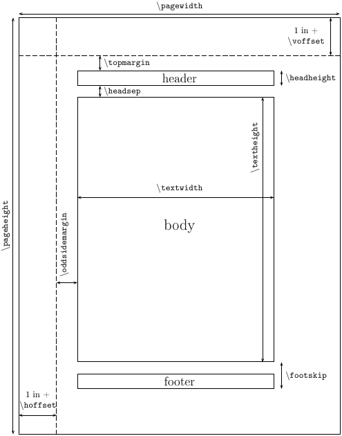

https://www.latexstudio.net/hulatex/package/layout.htm

# 简单示例

```latex
\documentclass{article} 

\begin{document}

hello world!

\end{document}
```

## 自定义水平缩进

```latex
% 自定义水平缩进
\newcommand{\myindent}{\hspace{0.820cm}}
```

## 图标和文本同一水平

```latex
\usepackage[export]{adjustbox}

% 添加图标和文本，且图片和文字水平对齐
\myindent
\includegraphics[width=0.5cm, valign=c]{data/imgs/basic-info.png}
\myindent
{\CJKfamily{YaHei}\fontsize{12pt}{32pt}\selectfont\textbf{\textcolor[RGB]{68,68,68}{基本信息}}}
```

```latex
% 添加图标和文本，且图片和文字水平对齐
\myindent
\raisebox{-0.15\height}{\includegraphics[width=0.5cm]{data/imgs/basic-info.png}}
\myindent
{\CJKfamily{YaHei}\fontsize{12pt}{32pt}\selectfont\textbf{\textcolor[RGB]{68,68,68}{基本信息}}}
```

## 添加图片

```latex
% 添加渐变色条
\myindent\includegraphics[width=17.88cm,height=0.15cm]{data/imgs/bar-span.png}
```

## 插入本地字体

```latex
% 加载 fontspec 宏包
\usepackage{fontspec}

% 定义自定义字体命令
\newfontfamily\EASTPAKBOLD[
    Path = ./fonts/ ,
    UprightFont = EASTPAK-BOLD.TTF
]{EASTPAK-BOLD}

% 添加英文标题
\begin{minipage}[t]{21cm}
  {\EASTPAKBOLD\fontsize{14.29pt}{32pt}\selectfont
  \myindent\textbf{\textcolor[RGB]{68,68,68}{Expanded Carrier Screening, ECS}}}
\end{minipage}
```


# geometry，页面布局

在标准 LaTeX 中修改页面尺寸相当复杂，涉及了许多参数控制命令，见下图：



`geometry`宏包能自动填充各项页面尺寸，如果提供的页面设置数据不完整，它将自动补充剩余的数据；它采用页面自动居中自动平衡机制，所以只需提供最基本的页面尺寸数据，就可以获得所需的页面设置。

例如，设置四周边空各为 2cm 宽，无页眉的页面，只需要一条命令：`\usepackage[margin=2cm]{geometry}`。

该宏包提供了大量的选项，可简便灵活地设定纸张大小、页面方向、页眉和页脚区域、边空宽度和边空注释等等，下表所列为常用选项：

| 选项                        | 说明                                                         |
| --------------------------- | ------------------------------------------------------------ |
| a4paper、b5paper、a5paper   | 设置标准页面外形尺寸                                         |
| screen                      | 幻灯页面，宽225×高180                                        |
| paperwidth=宽度             | 修改页面宽度，高度不变                                       |
| paperheight=高度            | 修改页面高度，宽度不变                                       |
| papersize={宽度,高度}       | 设置页面尺寸                                                 |
| landscape                   | 横向页面                                                     |
| portrait                    | 纵向页面                                                     |
| hscale=宽度比值             | 正文宽度与页面宽度之比，默认值0.7                            |
| vscale=宽度比值             | 正文高度与页面高度之比，默认值0.7                            |
| scale= {宽度比值 ,宽度比值} | 正文主体与页面之比，                                         |
| width=宽度                  | 正文主体宽度                                                 |
| height=高度                 | 正文主体高度，不含页眉页脚                                   |
| total={宽度,高度}           | 正文主体区域的宽度与高度                                     |
| hmargin={左边空宽,右边空宽} | 左右边空宽度，若相等hmargin=宽度                             |
| vmargin={上边空宽,下边空宽} | 上下边空宽度，若相等vmargin=宽度                             |
| margin={A,B}                | 边空设置，相当 hmargin={A,B} 和 vmargin={A,B}，等边空 margin=A |
| centering                   | 自动居中                                                     |
| headheight=长度             | 页眉高度                                                     |
| headsep=长度                | 页眉底线与正文顶线间距                                       |
| footskip=长度               | 页脚底线与正文底线距离                                       |
| nohead                      | 无页眉                                                       |
| nofoot                      | 无页脚                                                       |
| noheadfoot                  | 无页眉页脚                                                   |
| footnotesep=长度            | 正文底线与脚注顶线间距                                       |


```latex
# 1.
# 设置页面宽度为 21 厘米
# 设置页面高度为 29.7 厘米
# 设置页面所有边的页边距为 0pt，即内容会紧贴页面边缘，没有任何空白边
\usepackage[paperwidth=21cm, paperheight=29.7cm, margin=0pt]{geometry}
```

