# CUDA

## 检查支持版本

开始菜单检索`NVIDIA 控制面板`，并打开：

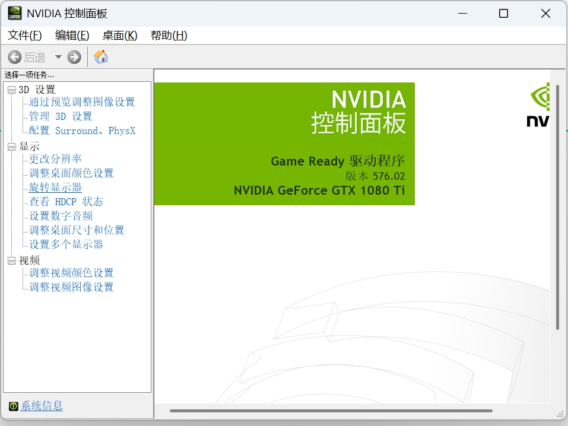


找到左下角的`系统信息`，点击`组件`，出下以下界面；从 NVCUDA64.DLL 这一行后面的 **CUDA 12.9.40** 说明我的电脑所支持的最高版本是 **12.9** 。

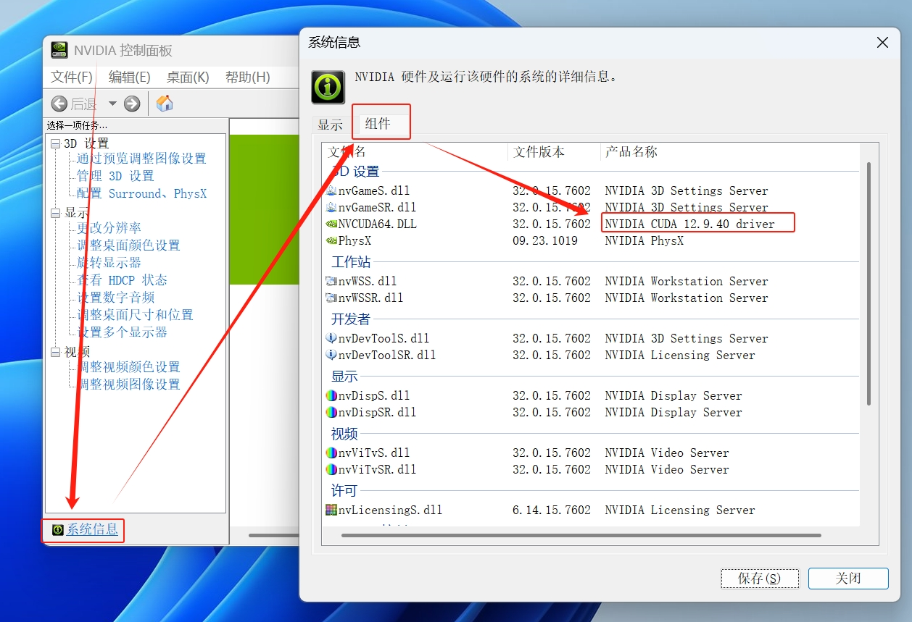

## 下载对应版本的 CUDA 程序

[CUDA Toolkit Archive](https://developer.nvidia.com/cuda-toolkit-archive)，页面检索下载对应的版本即可。

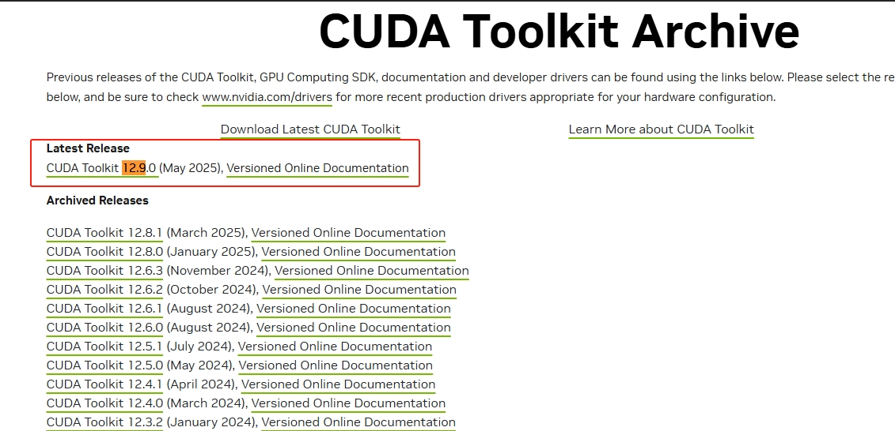

然后结合自己的系统信息，一步一步往下勾选即可：

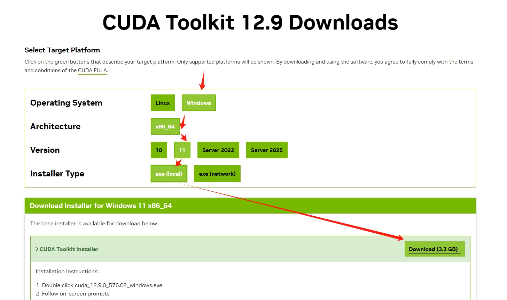

## 安装 CUDA 程序

下载完成之后，双击点击程序，开始安装，首先设置临时解压目录，一般默认即可：

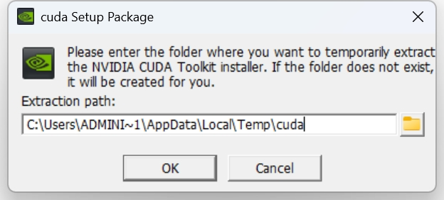


解压完成后会有安装程序，同意即可，接下来的安装选项自定义：

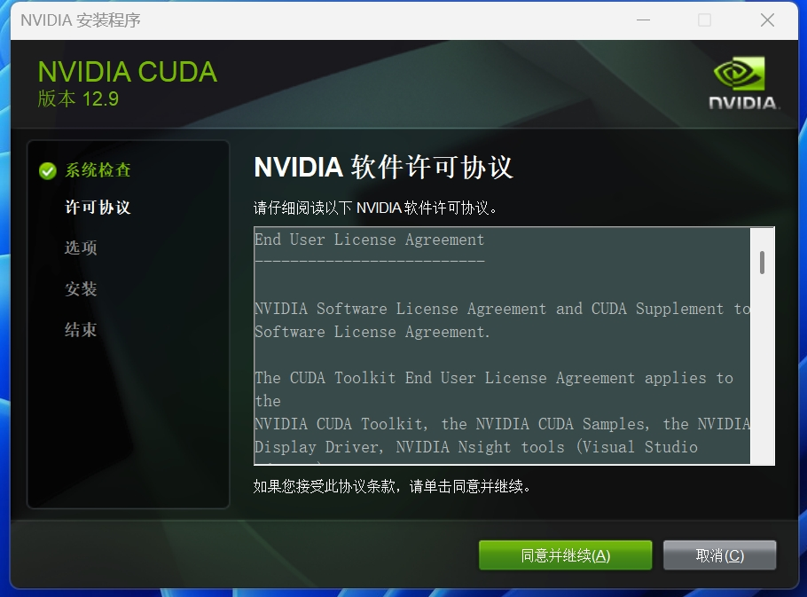

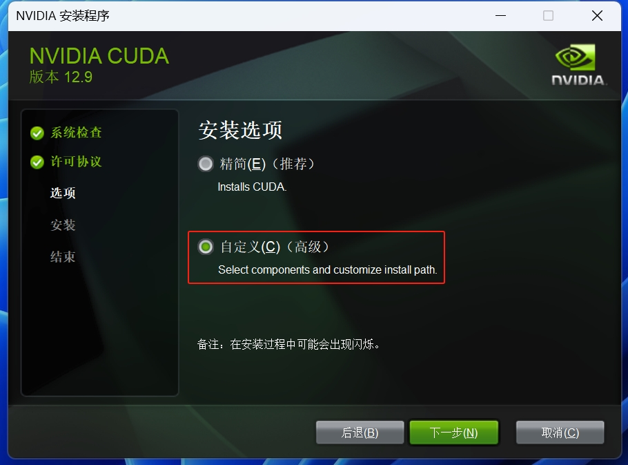


在安装 CUDA 中取消这个 Visual Studio Integration 有关的组件：

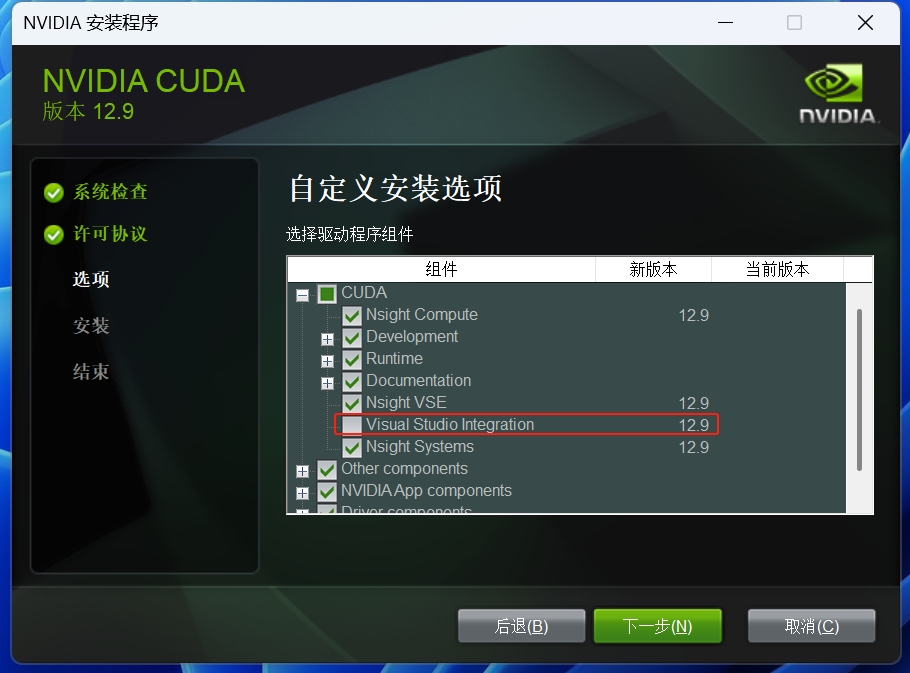


底下这三个也没必要，可安可不安，看个人选择：

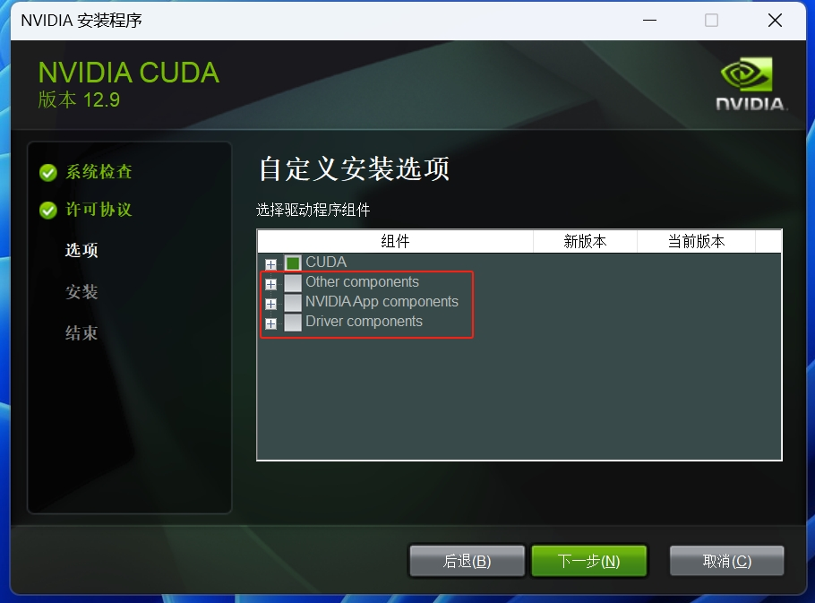


安装路径任然建议默认，在 Program Files 中，方便以后寻找，建议记住这里的 CUDA 路径：

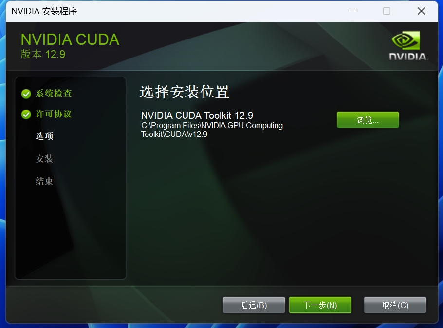


然后一直确认最后关闭即可，这里不多赘述：

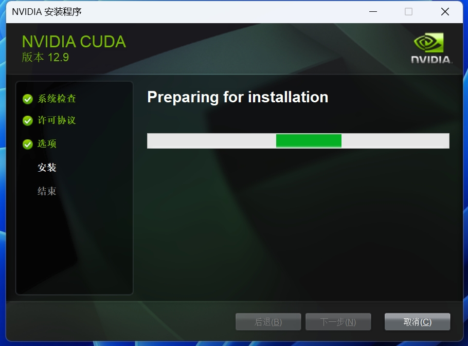

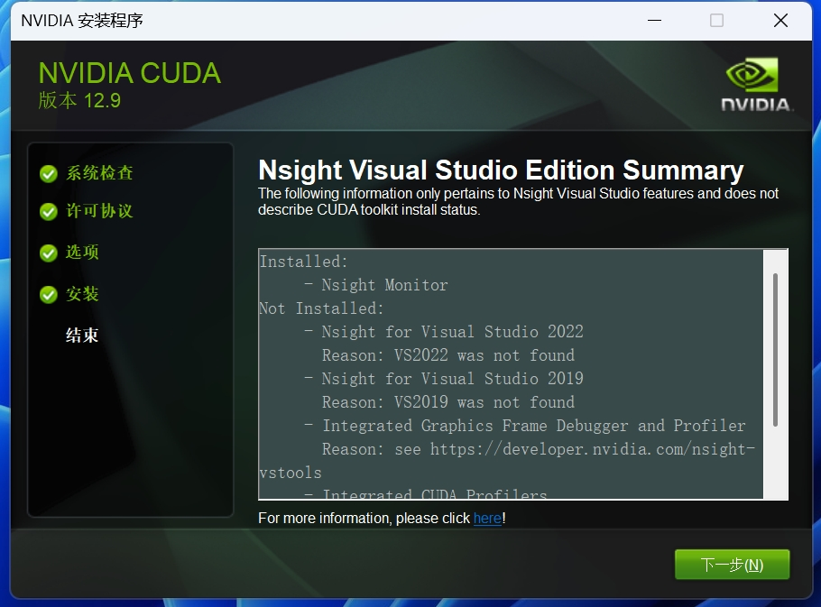

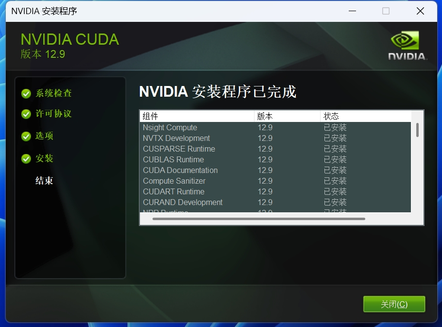

## 验证是否安装成功

`C:\Program Files\NVIDIA GPU Computing Toolkit\CUDA\v12.9\bin`添加到系统环境。

```cmd
> nvcc -V
nvcc: NVIDIA (R) Cuda compiler driver
Copyright (c) 2005-2025 NVIDIA Corporation
Built on Wed_Apr__9_19:29:17_Pacific_Daylight_Time_2025
Cuda compilation tools, release 12.9, V12.9.41
Build cuda_12.9.r12.9/compiler.35813241_0
```

# cnDNN

## 下载对应版本的 cnDNN 程序

[https://developer.nvidia.com/cudnn](https://developer.nvidia.com/cudnn)，在 cuDNN 的版本中，选择支持该版本的 CUDA 即可，然后点击下载即可：

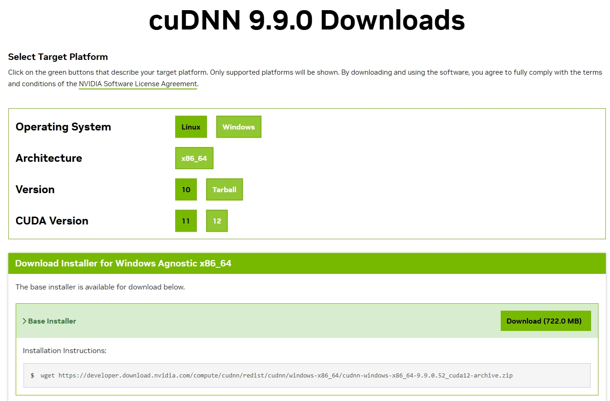

## 安装 cnDNN 程序

接下来，解压该压缩包，然后复制其中的文件夹：

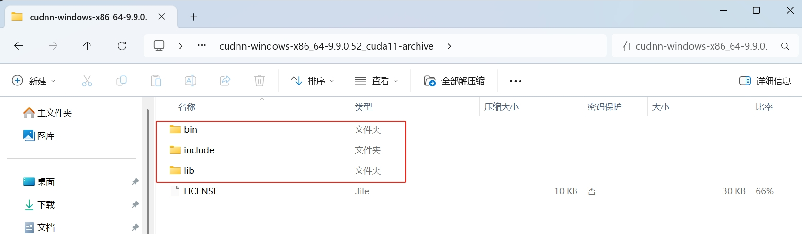


粘贴到 CUDA 的安装目录下，即完成了 cuDNN 的安装：

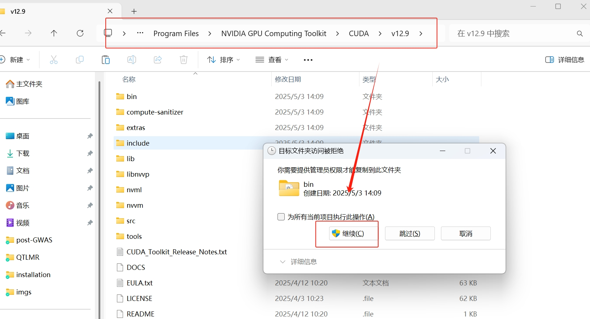

## 验证是否安装成功

`C:\Program Files\NVIDIA GPU Computing Toolkit\CUDA\v12.9\extras\demo_suite`，执行`bandwidthTest.exe`，如果运行结果出现了 PASS 即代表安装成功。

```cmd
C:\Program Files\NVIDIA GPU Computing Toolkit\CUDA\v12.9\extras\demo_suite>bandwidthTest.exe
[CUDA Bandwidth Test] - Starting...
Running on...

 Device 0: NVIDIA GeForce GTX 1080 Ti
 Quick Mode

 Host to Device Bandwidth, 1 Device(s)
 PINNED Memory Transfers
   Transfer Size (Bytes)        Bandwidth(MB/s)
   33554432                     6367.3

 Device to Host Bandwidth, 1 Device(s)
 PINNED Memory Transfers
   Transfer Size (Bytes)        Bandwidth(MB/s)
   33554432                     6446.7

 Device to Device Bandwidth, 1 Device(s)
 PINNED Memory Transfers
   Transfer Size (Bytes)        Bandwidth(MB/s)
   33554432                     383865.7

Result = PASS

NOTE: The CUDA Samples are not meant for performance measurements. Results may vary when GPU Boost is enabled.
```

再输入命令`deviceQuery.exe`查询设备，这里会显示你的 GPU 型号，以及 PASS，表示 CUDA 和 cuDNN 都安装成功了。

```cmd
C:\Program Files\NVIDIA GPU Computing Toolkit\CUDA\v12.9\extras\demo_suite>deviceQuery.exe
deviceQuery.exe Starting...

 CUDA Device Query (Runtime API)

Detected 1 CUDA Capable device(s)

Device 0: "NVIDIA GeForce GTX 1080 Ti"
  CUDA Driver Version / Runtime Version          12.9 / 12.9
  CUDA Capability Major/Minor version number:    6.1
  Total amount of global memory:                 11264 MBytes (11811028992 bytes)
  (28) Multiprocessors, (128) CUDA Cores/MP:     3584 CUDA Cores
  GPU Max Clock rate:                            1645 MHz (1.64 GHz)
  Memory Clock rate:                             5505 Mhz
  Memory Bus Width:                              352-bit
  L2 Cache Size:                                 2883584 bytes
  Maximum Texture Dimension Size (x,y,z)         1D=(131072), 2D=(131072, 65536), 3D=(16384, 16384, 16384)
  Maximum Layered 1D Texture Size, (num) layers  1D=(32768), 2048 layers
  Maximum Layered 2D Texture Size, (num) layers  2D=(32768, 32768), 2048 layers
  Total amount of constant memory:               zu bytes
  Total amount of shared memory per block:       zu bytes
  Total number of registers available per block: 65536
  Warp size:                                     32
  Maximum number of threads per multiprocessor:  2048
  Maximum number of threads per block:           1024
  Max dimension size of a thread block (x,y,z): (1024, 1024, 64)
  Max dimension size of a grid size    (x,y,z): (2147483647, 65535, 65535)
  Maximum memory pitch:                          zu bytes
  Texture alignment:                             zu bytes
  Concurrent copy and kernel execution:          Yes with 1 copy engine(s)
  Run time limit on kernels:                     Yes
  Integrated GPU sharing Host Memory:            No
  Support host page-locked memory mapping:       Yes
  Alignment requirement for Surfaces:            Yes
  Device has ECC support:                        Disabled
  CUDA Device Driver Mode (TCC or WDDM):         WDDM (Windows Display Driver Model)
  Device supports Unified Addressing (UVA):      Yes
  Device supports Compute Preemption:            Yes
  Supports Cooperative Kernel Launch:            Yes
  Supports MultiDevice Co-op Kernel Launch:      No
  Device PCI Domain ID / Bus ID / location ID:   0 / 1 / 0
  Compute Mode:
     < Default (multiple host threads can use ::cudaSetDevice() with device simultaneously) >

deviceQuery, CUDA Driver = CUDART, CUDA Driver Version = 12.9, CUDA Runtime Version = 12.9, NumDevs = 1, Device0 = NVIDIA GeForce GTX 1080 Ti
Result = PASS
```

# PyTorch

进入[PyTorch](https://pytorch.org/)官网，选择需要安装的 PyTorch 版本。这里安装方式可以选择 pip，可以看到生成的 command，只需要进入该网址下载即可：

```shell
pip3 install torch torchvision torchaudio --index-url https://download.pytorch.org/whl/cu128
```

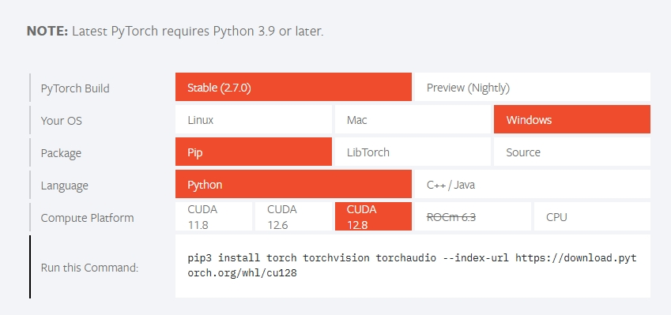

## GPU test

```python
import torch
import time

def check_gpu_availability():
    
    """检查 GPU 是否可用"""
    if torch.cuda.is_available():
        print(f"✅ GPU 可用，设备名称: {torch.cuda.get_device_name(0)}")
        print(f"CUDA 版本: {torch.version.cuda}")
        return True
    else:
        print("❌ GPU 不可用，将使用 CPU")
        return False

def test_gpu_performance():
    """测试 GPU 计算性能"""
    device = torch.device("cuda" if torch.cuda.is_available() else "cpu")
    print(f"使用设备: {device}")

    # 创建两个大型随机张量
    size = (10000, 10000)  # 调整大小以测试性能
    a = torch.randn(size, device=device)
    b = torch.randn(size, device=device)

    # 测试矩阵乘法（GPU 加速）
    start_time = time.time()
    c = torch.matmul(a, b)
    elapsed_time = time.time() - start_time

    print(f"矩阵乘法耗时: {elapsed_time:.4f} 秒")

if __name__ == "__main__":
    
    print("=== GPU 测试脚本 ===")
    if check_gpu_availability():
        test_gpu_performance()
```

```
=== GPU 测试脚本 ===
✅ GPU 可用，设备名称: NVIDIA GeForce GTX 1080 Ti
CUDA 版本: 12.8
使用设备: cuda
矩阵乘法耗时: 0.0302 秒
```

## GPU vs CPU

```python
import time
import torch

def compare_cpu_gpu():
    size = (20000, 20000)
    
    # CPU 计算
    start = time.time()
    a_cpu = torch.randn(size)
    b_cpu = torch.randn(size)
    torch.matmul(a_cpu, b_cpu)
    cpu_time = time.time() - start

    # GPU 计算
    start = time.time()
    a_gpu = torch.randn(size, device="cuda")
    b_gpu = torch.randn(size, device="cuda")
    torch.matmul(a_gpu, b_gpu)
    gpu_time = time.time() - start

    print(f"CPU 耗时: {cpu_time:.4f} 秒")
    print(f"GPU 耗时: {gpu_time:.4f} 秒")
    print(f"GPU 加速比: {cpu_time / gpu_time:.2f}x")

compare_cpu_gpu()
```

```
CPU 耗时: 17.3024 秒
GPU 耗时: 0.0095 秒
GPU 加速比: 1819.75x
```

