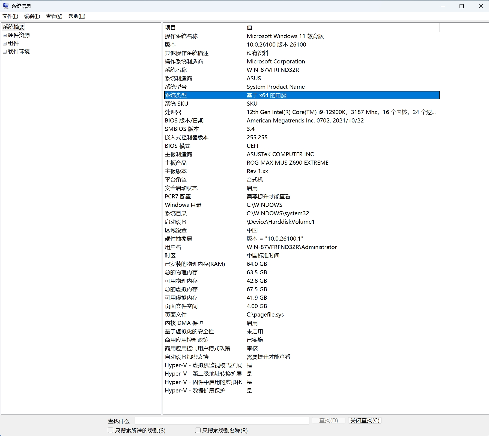
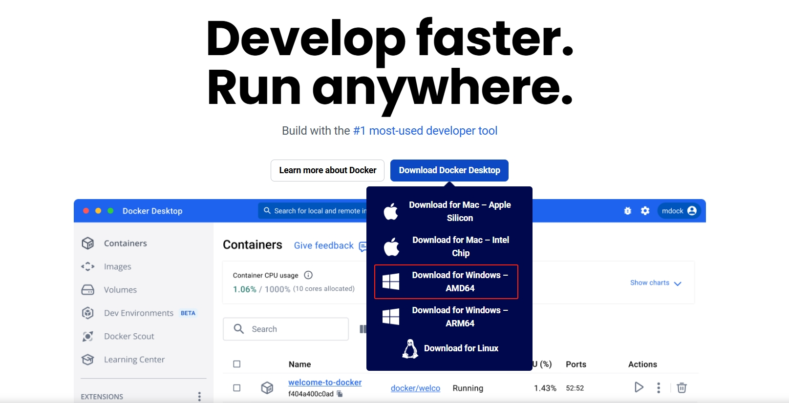
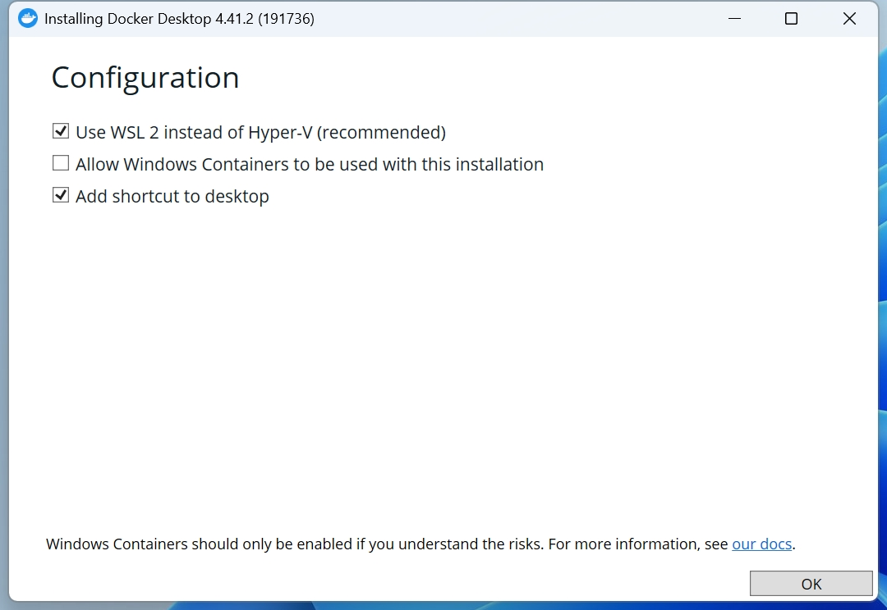
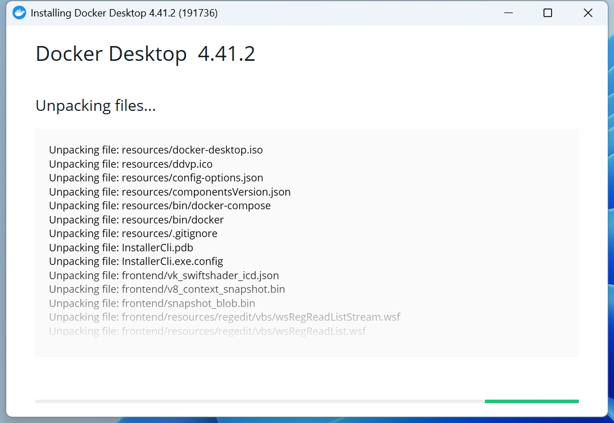
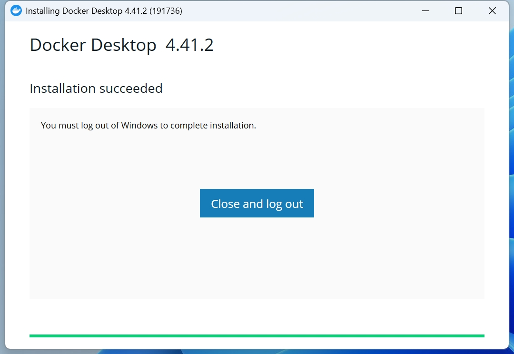

要在本地配置 LaTeX 和 Visual Studio Code 环境，首先需要安装一个 LaTeX 发行版（如 TeX Live、MikTeX 或 MacTeX），它提供了编译 LaTeX 文件所需的工具；然后安装 VS Code 编辑器，并添加 LaTeX Workshop 插件，这个插件可以帮助你进行代码高亮、自动补全、实时预览等操作。安装完成后，需要在 VS Code 的设置中配置 LaTeX 的编译工具链，并选择适合的编译流程（如 `pdflatex` 或 `xelatex`）。最后，通过创建一个 `.tex` 文件编写测试文档，保存后插件会自动编译，生成 PDF 文件，你可以直接在 VS Code 中查看输出结果。如果需要支持中文，可以使用 `ctex` 宏包，确保正确安装中文字体相关的包。这样，一个简单高效的 LaTeX 工作环境就搭建完成了！

# 安装 Docker Desktop 环境

本文基于 Windows 11 系统进行演示。

## 查看系统架构

1. 按下`Win + R`快捷键，打开`运行`对话框；
2. 输入`msinfo32`，然后按`Enter`键；
3. 在系统信息窗中，查找**系统类型**字段，如果显示**基于 x64 的电脑**，则操作系统是 64 位的，通常对应的是 AMD 架构；如果显示 **AMR 基于电脑**，则操作系统是 ARM 架构的。



## 下载 Docker Desktop Installer.exe 文件

打开 Docker 官网：[https://www.docker.com/](https://www.docker.com/)，并下载`Docker Desktop Installer.exe`文件：



## 运行安装程序

双击`Docker Desktop Installer.exe`程序文件，开始安装，默认即可：




接下来，耐心等待即可：




安装完成：




点击`Cloase and log out`会立即注销你的电脑，注意提前存档文件。

## 配置 Docker Desktop


## 创建账号并登录


如题，自行创建账号并登录即可：


# Docker Desktop - WSL update failed

## 确认系统是否支持 WSL2 功能

一般只有 Windows 10 或 Windows 11 才能使用 WSL2 功能。

## 添加 Hyper-V 功能 (未测试)

注意如果系统版本为家庭版的用户在 Windows 功能中没有"虚拟机平台"这一项，需要用管理员身份启动 Windows PowerShell 额外使用如下命令开启，接着在如下网站里下载 Windows 内核功能包安装插件并重启电脑即可。

`Hyper-V`预安装在 Windows 11 专业版、企业版和教育版中，只需启用即可。但是，在其他版本 (如 Windows 11 家庭版) 中，缺少启用`Hyper-V`的选项。


复制以下代码存为`hyper-v.bat`：

```bat
pushd "%~dp0"
dir /b %SystemRoot%\servicing\Packages\*Hyper-V*.mum >hyper-v.txt
for /f %%i in ('findstr /i . hyper-v.txt 2^>nul') do dism /online /norestart /add-package:"%SystemRoot%\servicing\Packages\%%i"
del hyper-v.txt
Dism /online /enable-feature /featurename:Microsoft-Hyper-V-All /LimitAccess /ALL
```

然后以管理员身份运行，并且按照提示输入`Y`，重启电脑，这个时候，就会发现有了`hyper-v`。

## 开启 Hyper-V 功能


## 安装 WSL 服务


[https://github.com/microsoft/WSL/releases/latest ⁠](https://github.com/microsoft/WSL/releases/latest) 下载安装最新的 WSL，这里以 [wsl.2.4.13.0.x64.msi](https://github.com/microsoft/WSL/releases/download/2.4.13/wsl.2.4.13.0.x64.msi) 为例。

下载完成后，双击安装即可，然后将程序路径`C:\Program Files\WSL`添加到系统环境变量`PATH`中即可。

