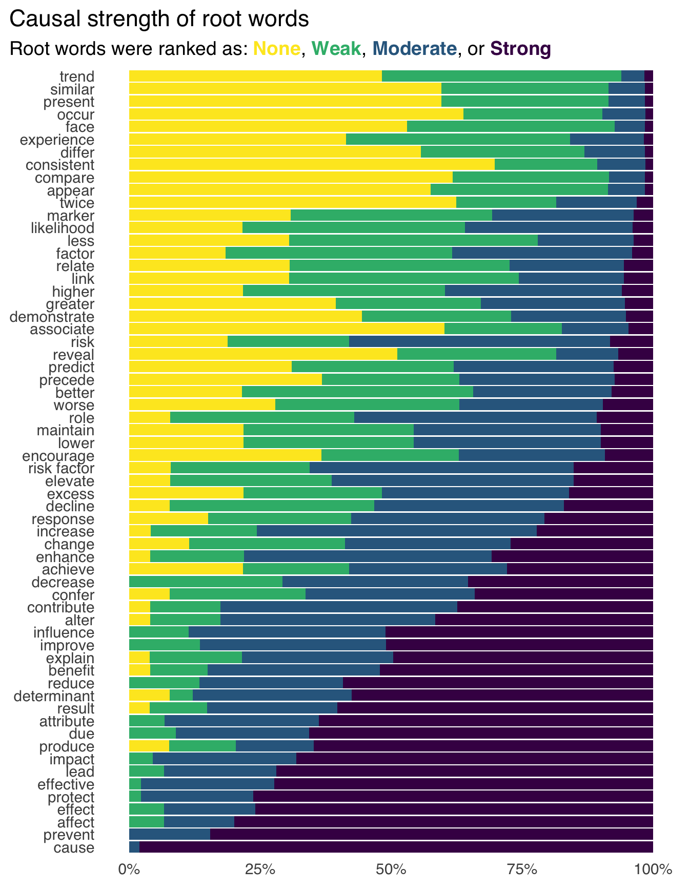
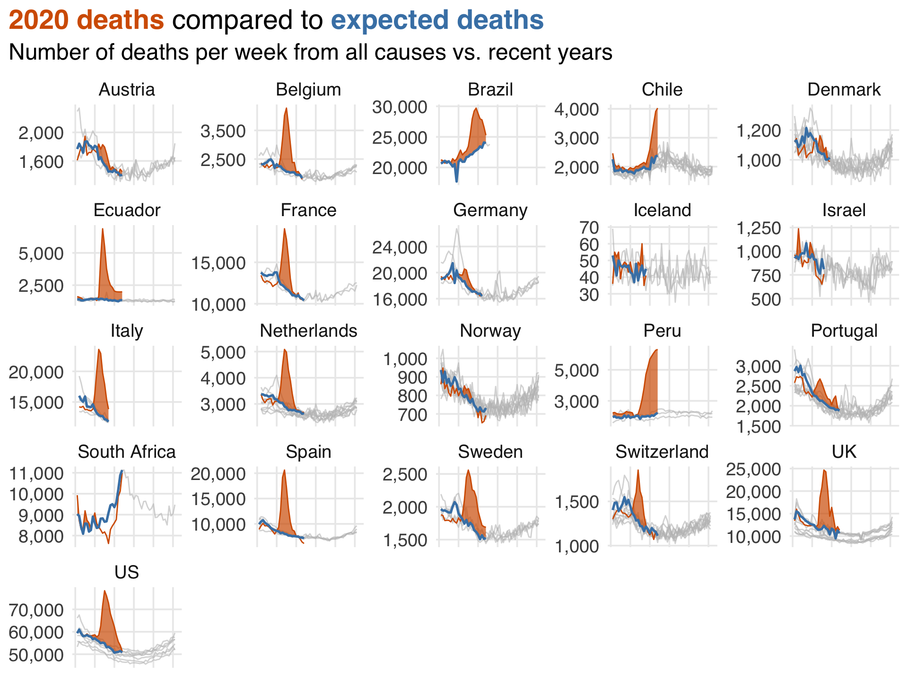

# 因果推断

因果分析的核心在于因果问题；它决定了我们分析哪些数据、如何分析数据，以及我们的推断适用于哪些人群。因果问题属于数据科学主要任务相关的更广泛问题集合，这些任务包括描述、预测和因果推断。遗憾的是，这些任务常常因为我们使用的技术（例如回归分析对于三者都很有用）以及我们表达的方式而混淆。当研究人员希望从非随机化数据中进行因果推断时，我们常常用关联这种委婉说法，来代替直接表明我们想要估计因果效应的意图。

例如，在一项关于流行病学研究中分析用语的最新研究中，用于描述估计效应的最常见词根是`associate`（关联），但许多研究人员也认为关联至少暗示了一定的因果效应（下图所示）。在分析的研究中，只有大约 1% 使用了`cause`（因果）这个词根。然而，有三分之一的研究提出了行动建议，研究人员评估这些建议时，认为 80% 至少有某种因果含义。通常，这些研究提出的行动建议（暗指因果效应）比描述效应时用的词（如`associate`和`compare`）所暗示的因果性更强。

<b>
图 1 研究人员使用的词根因果强度排名；拥有更多 Strong 排名的词根比拥有许多 None 或 Weak 排名的词根具有更强的因果含义
</b>

因此，与那些有明确假设和目标的问题不同，大多数研究最终得到的却是`薛定谔的因果推断`。

> "薛定谔的因果推断" Schrödinger’s causal inference，即研究在避免声明（甚至明确否认）估算因果效应兴趣的同时，又在其他方面充满了因果意图、推断、含义和建议。这个说法，是借用了物理学中著名的薛定谔的猫思想实验来打比方。在原本的物理实验里，薛定谔的猫既"死"又"活"，直到你打开盒子观察它，才确定其状态。这种状态被称为"叠加态"。
>
> 在因果推断领域，薛定谔的因果推断指的是 —— 研究者在论文和分析中，**表面上避免明确声明自己是在做因果推断**，甚至有时还否认自己要推断因果效应；但实际上，他们的研究内容、推理过程、结论、甚至行动建议，却都隐含或直接基于因果推断的思路和假设。**特殊含义**在于：
>
> - **"亦因果，亦非因果"**，这些研究既不明确说我们在做因果推断，又不完全回避因果推断的逻辑，处于一种半明半暗的状态 —— 正如薛定谔的猫既死又活；
>
> - **学术上的模糊性**，这种做法可能是为了回避同行评议时对因果推断严格假设的质疑，或者是因为数据和方法本身支撑不了严格的因果推断，但研究者又希望给出有用的政策或实践建议；
>
> - **潜在风险**，如果没有清楚地阐明自己是在做因果推断，相关的结论和建议可能会被误解，从而导致错误的政策或实践决策。
>
>   
>
> 薛定谔的因果推断是一种学术上的`暧昧`状态：研究者既想借助因果推断的力量，又不敢完全承担因果推断的责任。这一说法提醒我们，科学研究尤其是因果推断，需要直面并明确假设和目标，否则容易误导读者和决策者。

# 描述、预测与解释

解决上述问题的一个很好的第一步是认识到：**关于描述、预测和解释的问题本质上是不同的**。与学术界相比，数据科学并没有那么多薛定谔的因果推断的困扰，但随意推断在很多其他场景下也会发生。例如，当利益相关者询问某个事件的驱动因素时，他们到底在问什么？是想要一个可以预测事件的模型？还是更深入地理解导致事件发生的原因？这是一个模糊的请求，但对我们来说，明显带有因果兴趣；然而，很多数据科学家会倾向于用预测模型来回答这个问题。当我们明确自己的目标时，三种方法都可以更有效地使用（正如我们将看到的，即使目标是做因果推断，描述性分析和预测模型同样有用）。此外，这三种方法都是有用的决策工具。

## 描述

描述性分析旨在描述变量的分布，通常会按照关键变量进行分层。一个密切相关的概念是探索性数据分析（ Exploratory Data Analysis，EDA），但描述性研究往往有比 EDA 更明确的目标。**描述性分析通常基于统计摘要，如集中趋势（均值、中位数）和离散程度（最小值、最大值、四分位数）等指标，但有时也会用到回归建模等技术**。在描述性分析中应用回归等高级技术，其目的与预测或因果研究不同。对描述性分析来说，调整某个变量意味着我们在剔除它的关联效应（从而改变了我们的研究问题），而不是控制混杂因素。

在流行病学中，描述性分析的一个有价值的概念是**人、地、时** —— 谁患了什么病，在哪里，什么时候。这一概念同样可作为其他领域描述性分析的良好模板。通常，我们需要明确我们想要描述的是哪个人群，因此需要尽可能具体。以健康研究为例，描述参与者、地点和时间段都很关键。换句话说，要专注于理解数据的基本原则，并据此描述你的数据。

### 示例

对事物进行计数是我们用数据能做的最有价值的事情之一。EDA 不仅有利于预测和因果分析，描述性分析本身也很有价值。问问那些本以为自己要开发复杂机器学习模型、结果却发现大部分时间都在做数据仪表盘的研究者就知道了。了解数据的分布，尤其是与关键分析目标相关的数据分布（比如业界的 KPI 或流行病学中的疾病发病率），对于各种决策都至关重要。近期一个很好的描述性分析例子出现在新冠疫情期间。2020年，尤其是疫情早期，描述性分析对于理解风险和分配资源至关重要。由于新冠病毒与其他呼吸道疾病类似，我们拥有许多公共卫生工具来降低风险（如保持距离，后来还有佩戴口罩）。按地区统计病例的描述性数据对于制定本地政策及其力度非常重要。

疫情期间更复杂的一项描述性分析例子，是英国《金融时报》持续发布的各国和地区预期死亡人数与实际死亡人数的对比。虽然预期死亡人数的计算比一般描述性统计更复杂一些，但它为了解当下死亡状况提供了大量信息，而无需理清死亡的因果关系，比如是直接死于新冠？还是因无法就医？还是新冠后的心血管事件？如下图所示，可以看到疫情早期的巨大影响。

<b>
图 2 2020 年各地超额死亡人数与历史预期死亡人数
</b>

以下还有其他一些优秀的描述性分析案例：

- **全球森林砍伐**，Our World in Data 是一家数据新闻机构，通常会就各种话题制作有深度、偏重描述性的数据报告。在这份报告中，他们用数据可视化展现了森林覆盖变化的绝对量（森林转变）和相对量（森林砍伐或再造林），结合基础统计和林业理论，展现了森林状况的变化信息。
- **沙眼衣原体和淋病感染的流行率**，衡量疾病流行率（即目前患病人数，通常按每多少人一个比率表示）对于公共卫生（资源、预防、教育）和科学理解都很有帮助。在这项研究中，作者进行了一个复杂的、代表全美高中生（目标人群）的调查，使用加权处理了各种相关因素，然后计算了流行率比等统计量。如我们将在后文看到的，加权在因果推断中同样有用，因为它可以针对特定人群。当然，并不是所有加权技术都是因果性的，这项研究就不是。
- **按种族和族裔估算子宫切除手术不平等**，描述性技术也有助于我们理解经济学、流行病学等领域的差异。在这项研究中，作者问：不同种族或族裔的子宫切除风险是否不同？尽管分析按关键变量分层，本质上仍是描述性的。值得一提的是，作者为确保研究回答了关于正确目标人群的问题，结合了多个数据来源，以更好地估计真实的人群流行率（而不是医院内的流行率）。他们还对子宫切除的流行率进行了调整，例如只在尚未进行过手术的人群中计算新发病例率。

### 有效性

描述性分析中有两个关键的有效性问题：测量误差和抽样误差。

+ **测量误差** 是指对一个或多个变量的测量出现了偏差；对于描述性分析来说，测量错误意味着我们可能无法得到正确答案；当然，这种影响的程度取决于误差的严重性和具体问题。

+ **抽样误差** 在描述性分析中是一个更微妙的问题；它涉及我们分析的人群（分析结果应描述哪些人）以及不确定性（我们有多确定样本数据能代表我们要描述的人群）。

为了让我们的描述有效，数据来源人群和我们要描述的人群必须一致。假如我们用一项网络调查生成数据，答题者是谁？他们与我们想描述的人群是什么关系？实际上，很多情况下，愿意回答调查的人和我们希望描述的人群并不一样，例如填写问卷的人与不填写的人变量分布可能不同。此类数据的结果在技术上并不算有偏差，因为除了样本量相关的不确定性和测量误差外，对这批人群的描述是准确的——只是对象不是我们想要的那组人！换句话说，我们得到了错误问题的答案。

值得注意的是，有时我们的数据覆盖了整个目标人群（或几乎如此），此时抽样误差就无关紧要了。比如一家公司掌握了所有客户的完整数据，对这些客户进行分析，实际上就覆盖了整个现有客户人群。同样，在有全民健康登记的国家，特定实际目的的数据也足够接近“全体人群”，无需抽样（虽然有时为了计算方便还是会抽样）。在这些情况下，实际上就没有不确定性。只要测量没问题，我们得到的统计摘要就是无偏且精确的，因为覆盖了所有人。当然，现实中即使在最理想情况下，也会有测量误差、缺失数据等问题。

描述性分析的一个重要细节是：**混杂偏倚 —— 本文章关注的核心问题之一 —— 在这里并不存在。因为混杂是因果性问题。描述性分析只是对现有关系做统计描述，而不是探究它们背后的机制，所以不存在混杂偏倚。

### 与因果推断的关系

**人类非常善于发现模式**。这是我们大脑的有用特性，但如果没有合适的数据或方法，这种模式识别也可能导致错误的推断。**当你的目标是描述时，最需要警惕的，就是从描述跳到因果，无论是隐式还是显式**。

当然，描述性分析在估计因果效应时也很有用。它帮助我们了解所研究人群、结局变量、暴露变量（我们认为可能有因果作用的变量）和混杂因素（需要控制以获得无偏因果效应的变量）的分布，也有助于确保我们所用的数据结构与要回答的问题相匹配。

进行因果研究时，务必先做描述性分析。在某些情况下，我们可以用基础统计方法做因果推断。但即使用的是同样的计算方法（如均值差），描述性分析和因果分析并不等价。一个描述性分析是否与因果分析重叠，取决于数据和研究问题。

