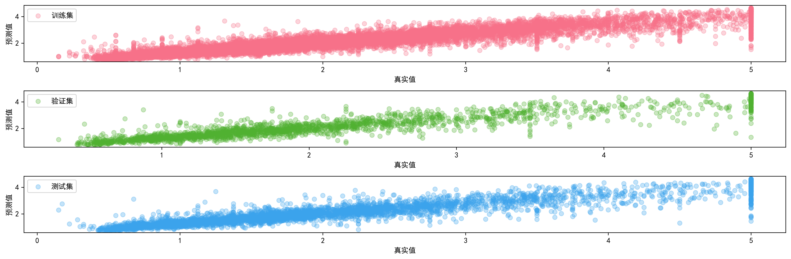
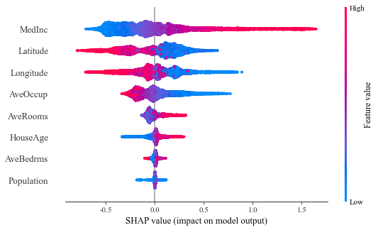
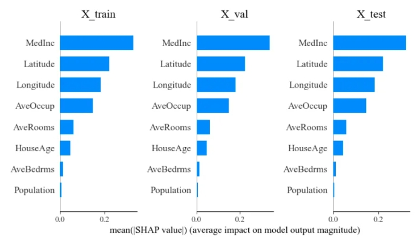
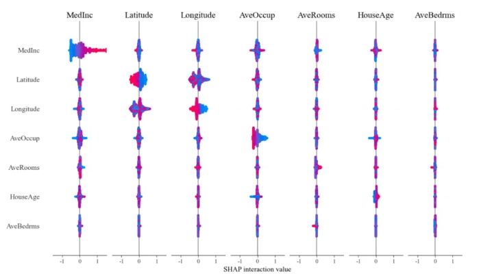

在机器学习和深度学习领域，模型解释是一个重要的问题，尽管复杂的模型如深度神经网络和集成模型，如`XGBoost`、`LightGBM`在预测性能上表现优异，但它们通常被认为"黑箱"，难以解释其内部决策过程，SHAP (SHapley Additive exPlanations) 是一种解决这一问题的工具，通过分配特征的重要性值来解释模型的输出。

# 基本概念

SHAP 的核心思想源自合作博弈论中的 Shapley 值，Shapley 值用于公平分配多个参与者在合作中所带来的收益，SHAP 将这一概念引入到机器学习模型解释中，用于计算每个特征对模型预测结果的贡献。

## SHAP 的特点

**一致性**，如果模型的特征贡献增加，那么 SHAP 值也会增加；

**局部解释**，SHAP 值可以解释单个预测结果，从而提供针对单一数据点的解释；

**全局解释**，通过对多个数据点的 SHAP 值进行汇总，可以提供模型的全局解释。

## SHAP 的计算

1. 生成所有可能的特征组合，计算特征在各种组合中的贡献；
2. 计算边际贡献，对每个特征，计算其在不同特征组合中的边际贡献；
3. 求平均值，对边际贡献进行加权平均，得到特征的 SHAP 值。

## SHAP 的应用

**特征重要性排序**：通过 SHAP 值，可以直观地看到哪些特征对模型预测结果影响最大

**解释个体预测**：SHAP 值可以解释单个数据点的预测结果，帮助理解模型为何做出某个预测

**异常检测**：通过分析 SHAP 值，可以发现异常数据点和潜在的问题特征

## SHAP 在实践中的使用

SHAP 支持多种机器学习框架，如 XGBoost、LightGBM、sklearn、TensorFlow 等，使用 SHAP 时，通常包括以下步骤：

**训练模型**：使用数据集训练机器学习模型

**计算 SHAP 值**：使用 SHAP 库计算每个特征的 SHAP 值

**可视化与解释**：通过可视化方法展示 SHAP 值，进行模型解释

# 简单示例

## 加载所需模块

```python
import pandas as pd
import numpy as np
import seaborn as sns
import lightgbm as lgb
import matplotlib.pyplot as plt 
from sklearn.model_selection import train_test_split
```

## 搭建 LightGBM 模型

```python
plt.rcParams['font.sans-serif'] = 'SimHei'
plt.rcParams['axes.unicode_minus'] = False
df = pd.read_excel('C:/Users/Administrator/Desktop/california.xlsx')

X = df.drop(['price'],axis=1)
y = df['price']

X_temp, X_test, y_temp, y_test = train_test_split(X, y, test_size=0.2, random_state=42)

# 然后将训练集进一步划分为训练集和验证集
X_train, X_val, y_train, y_val = train_test_split(X_temp, y_temp, test_size=0.125, random_state=42)  # 0.125 x 0.8 = 0.1

# 数据集标准化
x_mean = X_train.mean()
x_std =  X_train.std()
y_mean = y.mean()
y_std = y.std()
X_train = (X_train - x_mean)/x_std
y_train = (y_train-y_mean)/y_std
X_val = (X_val - x_mean)/x_std
y_val = (y_val - y_mean)/y_std
X_test = (X_test - x_mean)/x_std
y_test = (y_test - y_mean)/y_std


# LightGBM 模型参数
params_lgb = {
    'learning_rate': 0.02,          # 学习率，控制每一步的步长，用于防止过拟合。典型值范围：0.01 - 0.1
    'boosting_type': 'gbdt',        # 提升方法，这里使用梯度提升树（Gradient Boosting Decision Tree，简称GBDT）
    'objective': 'mse',             # 损失函数
    'metric': 'rmse',               # 评估指标
    'num_leaves': 127,              # 每棵树的叶子节点数量，控制模型复杂度。较大值可以提高模型复杂度但可能导致过拟合
    'verbose': -1,                  # 控制 LightGBM 输出信息的详细程度，-1表示无输出，0表示最少输出，正数表示输出更多信息
    'seed': 42,                     # 随机种子，用于重现模型的结果
    'n_jobs': -1,                   # 并行运算的线程数量，-1表示使用所有可用的CPU核心
    'feature_fraction': 0.8,        # 每棵树随机选择的特征比例，用于增加模型的泛化能力
    'bagging_fraction': 0.9,        # 每次迭代时随机选择的样本比例，用于增加模型的泛化能力
    'bagging_freq': 4               # 每隔多少次迭代进行一次bagging操作，用于增加模型的泛化能力
}

model_lgb = lgb.LGBMRegressor(**params_lgb)
model_lgb.fit(X_train, y_train, eval_set = [(X_val, y_val)], eval_metric = 'rmse')      
```

将数据集划分为训练集、验证集和测试集，并对其进行标准化处理，然后使用`LightGBM`模型进行训练，设置参数以防止过拟合和提高泛化能力，到目前为止就构建了一个`LighGBM`模型，对这个预测结果进行一个简单的可视化：

```python
pred_train = model_lgb.predict(X_train)
pred_val = model_lgb.predict(X_val)
pred_test = model_lgb.predict(X_test)

y_train_h = y_train*y_std+y_mean
pred_train_h = pred_train*y_std+y_mean

y_val_h = y_val*y_std+y_mean
pred_val_h = pred_val*y_std+y_mean

y_test_h = y_test*y_std+y_mean
pred_test_h = pred_test*y_std+y_mean

colors = sns.color_palette("husl", 3)

plt.figure(figsize = (15,5), dpi = 300)
plt.subplot(3, 1, 1)
plt.scatter(y_train_h, pred_train_h, label = '训练集', alpha = 0.3, color = colors[0])
plt.xlabel('真实值')
plt.ylabel('预测值')
plt.legend()
plt.subplot(3, 1, 2)
plt.scatter(y_val_h, pred_val_h, label = '验证集', alpha = 0.3, color = colors[1])
plt.xlabel('真实值')
plt.ylabel('预测值')
plt.legend()
plt.subplot(3, 1, 3)
plt.scatter(y_test_h, pred_test_h, label = '测试集', alpha = 0.3, color = colors[2])
plt.xlabel('真实值')
plt.ylabel('预测值')
plt.legend()
plt.tight_layout()
plt.show()
```

将模型预测结果与真实值进行比较并可视化，但这种简单的可视化无法深入解释模型的决策过程。



我们可以借助 SHAP 值进一步分析模型特征的重要性和贡献度。

## 摘要图 Summary Plot

```python
# 构建 shap 解释器
explainer = shap.TreeExplainer(model_lgb)

# 计算测试集的 shap 值
shap_values = explainer.shap_values(X_train)

# 特征标签
labels = X_train.columns
plt.rcParams['font.family'] = 'serif'
plt.rcParams['font.serif'] = 'Times new Roman'
plt.rcParams['font.size'] = 13
plt.figure()
shap.summary_plot(shap_values, X_train, feature_names = labels, plot_type = "dot")
```



摘要图是 SHAP 常用的一种可视化方法，**用于显示特征的重要性和特征值的影响方向**，摘要图结合了特征重要性和特征效应图，**展示了每个特征的 SHAP 值的分布情况**，帮助我们理解每个特征对模型预测的贡献，这张可视化结果可在众多论文当中看见，当然你也可以通过参数`cmap`改变配色避免审美疲劳，例如 "viridis"：从黄色到蓝绿色；"Spectral"：从红色到蓝色，适用于有正负影响的特征；"coolwarm"：从冷到暖的颜色图；"RdYlGn"：从红到绿的颜色图；"RdYlBu"：从红到蓝的颜色图；"RdBu"：红蓝双色图；"RdGy"：红灰双色图；"PuOr"：从紫色到橙色的颜色图；"BrBG"：从棕色到蓝绿色的颜色图；"PRGn"：从紫色到绿色的颜色图；"PiYG"：从粉红色到绿色的颜色图。

接下来从不同角度对可视化进行解读：

+ **颜色**，红色点表示特征值在这个观察模型中对模型预测产生了正面影响；蓝色点则表示该特征值在这个观察中对模型预测产生负面影响；
+ **水平轴 (SHAP 值)**，显示每个特征对预测结果的影响大小，点越远离中心线 (零点)，表示该特征对模型输出的影响越大正的 SHAP 值表示正面影响，负的 SHAP 值表示负面影响；
+ **垂直轴 (特征排列)**，图中垂直排列的特征按影响力从上到小进行排序，上方的特征对模型输出的总影响更大，而下方的特征影响较小；
+ **特征影响力解释**，最上方特征，如 MedInc，显示了大量的正面和负面影响，表明其在不同的观察值对模型预测的结果有很大不同的影响；中部特征，如 AveRooms，也显示出两种颜色的点，但点的分布更集中，影响相对较小；底部特征，如 Population，对模型的影响最小，且大部分影响较为接近于零值，表示这些特征对模型预测的贡献较小。

<br>

其中如何去理解每个特征的 SHAP 值这句话 > shap_values 值反应的其实就是每一个样本，每一个特征对输出结果的影响

```python
print("SHAP维度:", shap_values.shape)
print("测试集维度:", X_train.shape)

SHAP维度: (14448, 8)
测试集维度: (14448, 8)
```

可以看见 shap_values 和测试集（这里做的摘要图是对测试集进行操作）维度是一致的，也就是每一个 SHAP 值实际和原始数据每一个点是一一对应的，当然也可以对所有数据集在一张画布上展示每一个特征的排序：

```python
# 计算训练集和测试集的 SHAP 值
shap_values_train = explainer.shap_values(X_train)
shap_values_val = explainer.shap_values(X_val)
shap_values_test = explainer.shap_values(X_test)

# 绘制 SHAP 值总结图
plt.figure(figsize = (15, 5))
plt.subplot(1, 3, 1)
shap.summary_plot(shap_values_train, X_train, plot_type = "bar", show = False)
plt.title("X_train")
plt.xlabel('')  # 移除 x 轴标签避免x轴重叠

plt.subplot(1, 3, 2)
shap.summary_plot(shap_values_val, X_val, plot_type = "bar", show = False)
plt.title("X_val")

plt.subplot(1, 3, 3)
shap.summary_plot(shap_values_test, X_test, plot_type = "bar", show = False)
plt.title("X_test")
plt.xlabel('')  

plt.tight_layout()
plt.show()
```



这里计算的就不再是每一个点的 SHAP 值，而是计算的每一个特征的重要程度，特征按照影响力从大到小进行排序，如何进行计算的呢？

```Python
# 利用测试集进行演示
np.abs(shap_values_train).mean(axis = 0)

array([0.3303671 , 0.04596684, 0.06076879, 0.01369498, 0.00545828,
       0.14907916, 0.22245749, 0.18385465])
```

就是把 SHAP_value 样本取绝对值的平均值从而得到每个特征的重要程度。

## 依赖图 Dependence Plot

```python
shap.dependence_plot('MedInc', shap_values, X_train, interaction_index = 'AveOccup')
```


依赖图用于显示一个特征的 SHAP 值与该特征值之间的关系，并可以展示特征之间的交互作用

在这里`shap.dependence_plot()`函数的参数解释如下：

```properties
MedInc 							: 这是你想要研究的特征名
shap_values						: 这是通过 SHAP 计算得到的特征重要性值
X_train							: 这是用于生成 SHAP 值的训练数据
interaction_index='AveOccup'	: 这是指定与主特征`MedInc`交互的特征，SHAP 会在图中显示两者的交互效果
```

<br>

最后对这个依赖图进行解读：

+ **正相关关系**，在这里随着 MedInc 的增加，目标变量 AveOccup 也随之增加 

+ **影响的程度**，MedInc 的值在 3 到 6 的范围内，SHAP 值变化并不明显，表明，在这个范围内，MedInc 对模型预测的目标变量影响并不大，反之成立

+ **交互效果**，通过观察图中的颜色变化，可以了解主特征与交互特征之间的关系以及它们对模型预测的共同影响

## 力图 Force Plot

```python
# 绘制单个样本的 SHAP 解释
# 选择一个样本索引进行解释
sample_index = 7
shap.force_plot(explainer.expected_value, shap_values_test[sample_index], X_test.iloc[sample_index], matplotlib = True)
```


力图用于直观地展示单个样本的 SHAP 值及其对模型预测结果的影响，通过力图，可以清晰地看到每个特征对该样本预测值的贡献。

<br>

力图解释：

**基线值**，图中的起点表示模型的基线值 (expected_value) 也就是可视化当中的( base value)

**特征贡献**：每个特征的贡献通过带颜色的条表示，条的长度表示该特征对最终预测值的影响大小，红色条表示正向贡献，即该特征使预测值增加，蓝色条表示负向贡献，即该特征使预测值减少

**预测值**：终点表示模型对该样本的最终预测值，这是基线值加上所有特征贡献的总和，在这里为 -0.31

## 交互作用摘要图 Interaction Summary Plot

```python
# 交互作用摘要图
shap_interaction_values = explainer.shap_interaction_values(X_train)
shap.summary_plot(shap_interaction_values, X_train)
```



用于展示特征之间交互作用的重要性和影响的一种可视化方法。

<br>

交互作用摘要图解释：

**特征排序**，特征按重要性排序，最重要的特征在图的顶部，每个特征的总重要性值是其与所有其他特征交互作用的重要性值之和

**SHAP 交互作用值分布**，每个点表示一个样本的交互作用值，交互作用值越大，表示该特征与另一个特征的交互对模型预测的影响越大

**颜色表示交互特征**，颜色表示与主特征交互的特征，使用颜色渐变来表示不同的特征交互效果

## 热图 Heatmap

```python
# 创建 shap.Explanation 对象
shap_explanation = shap.Explanation(
    values = shap_values_test[0:500,:], 
    base_values = explainer.expected_value, 
    data = X_test.iloc[0:500,:], feature_names=X_test.columns
)

# 绘制热图
shap.plots.heatmap(shap_explanation)
```


通过热图，可以有效地探索和理解复杂模型的特征重要性和特征之间的相互关系，从而提高模型的解释性和可解释性。

<br>

热图解读：左侧 y 轴为重要性特征排名，特征按影响力从大到小进行排序，右侧 y 轴为其可视化，图像中颜色深浅表示 SHAP 值的大小，也就是该特征下值对模型的影响，颜色越深 SHAP 值绝对值越大越影响模型，顶部为模型在这些数值下的预测结果可视化，这里只从测试集中选择了 500 个数据进行可视化，太多的数据会影响运行时间，以及可视化的精美，自行取舍。

## 完整代码

```python
import shap
import pandas as pd
import numpy as np
import seaborn as sns
import lightgbm as lgb
import matplotlib.pyplot as plt 
from sklearn.model_selection import train_test_split

plt.rcParams['font.sans-serif'] = 'SimHei'
plt.rcParams['axes.unicode_minus'] = False
df = pd.read_excel('C:/Users/Administrator/Desktop/california.xlsx')

X = df.drop(['price'],axis=1)
y = df['price']

X_temp, X_test, y_temp, y_test = train_test_split(X, y, test_size=0.2, random_state=42)

# 然后将训练集进一步划分为训练集和验证集
X_train, X_val, y_train, y_val = train_test_split(X_temp, y_temp, test_size=0.125, random_state=42)  # 0.125 x 0.8 = 0.1

# 数据集标准化
x_mean = X_train.mean()
x_std =  X_train.std()
y_mean = y.mean()
y_std = y.std()
X_train = (X_train - x_mean)/x_std
y_train = (y_train-y_mean)/y_std
X_val = (X_val - x_mean)/x_std
y_val = (y_val - y_mean)/y_std
X_test = (X_test - x_mean)/x_std
y_test = (y_test - y_mean)/y_std


# LightGBM 模型参数
params_lgb = {
    'learning_rate': 0.02,          # 学习率，控制每一步的步长，用于防止过拟合。典型值范围：0.01 - 0.1
    'boosting_type': 'gbdt',        # 提升方法，这里使用梯度提升树（Gradient Boosting Decision Tree，简称GBDT）
    'objective': 'mse',             # 损失函数
    'metric': 'rmse',               # 评估指标
    'num_leaves': 127,              # 每棵树的叶子节点数量，控制模型复杂度。较大值可以提高模型复杂度但可能导致过拟合
    'verbose': -1,                  # 控制 LightGBM 输出信息的详细程度，-1表示无输出，0表示最少输出，正数表示输出更多信息
    'seed': 42,                     # 随机种子，用于重现模型的结果
    'n_jobs': -1,                   # 并行运算的线程数量，-1表示使用所有可用的CPU核心
    'feature_fraction': 0.8,        # 每棵树随机选择的特征比例，用于增加模型的泛化能力
    'bagging_fraction': 0.9,        # 每次迭代时随机选择的样本比例，用于增加模型的泛化能力
    'bagging_freq': 4               # 每隔多少次迭代进行一次bagging操作，用于增加模型的泛化能力
}

model_lgb = lgb.LGBMRegressor(**params_lgb)
model_lgb.fit(X_train, y_train, eval_set = [(X_val, y_val)], eval_metric = 'rmse')      

# 将数据集划分为训练集、验证集和测试集，并对其进行标准化处理，
# 然后使用 LightGBM 模型进行训练，
# 设置参数以防止过拟合和提高泛化能力，到目前为止就构建了一个 LighGBM 模型，
# 对这个预测结果进行一个简单的可视化

pred_train = model_lgb.predict(X_train)
pred_val = model_lgb.predict(X_val)
pred_test = model_lgb.predict(X_test)

y_train_h = y_train*y_std+y_mean
pred_train_h = pred_train*y_std+y_mean

y_val_h = y_val*y_std+y_mean
pred_val_h = pred_val*y_std+y_mean

y_test_h = y_test*y_std+y_mean
pred_test_h = pred_test*y_std+y_mean

colors = sns.color_palette("husl", 3)

plt.figure(figsize = (15,5), dpi = 300)
plt.subplot(3, 1, 1)
plt.scatter(y_train_h, pred_train_h, label = '训练集', alpha = 0.3, color = colors[0])
plt.xlabel('真实值')
plt.ylabel('预测值')
plt.legend()
plt.subplot(3, 1, 2)
plt.scatter(y_val_h, pred_val_h, label = '验证集', alpha = 0.3, color = colors[1])
plt.xlabel('真实值')
plt.ylabel('预测值')
plt.legend()
plt.subplot(3, 1, 3)
plt.scatter(y_test_h, pred_test_h, label = '测试集', alpha = 0.3, color = colors[2])
plt.xlabel('真实值')
plt.ylabel('预测值')
plt.legend()
plt.tight_layout()
plt.show()

# 将模型预测结果与真实值进行比较并可视化，但这种简单的可视化无法深入解释模型的决策过程，
# 但是我们可以借助 SHAP 值进一步分析模型特征的重要性和贡献度

# 构建 shap 解释器
explainer = shap.TreeExplainer(model_lgb)

# 计算测试集的 shap 值
shap_values = explainer.shap_values(X_train)

# 特征标签
labels = X_train.columns
plt.rcParams['font.family'] = 'serif'
plt.rcParams['font.serif'] = 'Times new Roman'
plt.rcParams['font.size'] = 13
plt.figure()
shap.summary_plot(shap_values, X_train, feature_names = labels, plot_type = "dot")


# 可以看见 shap_values 和测试集（这里做的摘要图是对测试集进行操作）维度是一致的，
# 也就是每一个 SHAP 值实际和原始数据每一个点是一一对应的，
# 当然也可以对所有数据集在一张画布上展示每一个特征的排序：

# 计算训练集和测试集的 SHAP 值
shap_values_train = explainer.shap_values(X_train)
shap_values_val = explainer.shap_values(X_val)
shap_values_test = explainer.shap_values(X_test)

# 绘制 SHAP 值总结图
plt.figure(figsize = (15, 5))
plt.subplot(1, 3, 1)
shap.summary_plot(shap_values_train, X_train, plot_type = "bar", show = False)
plt.title("X_train")
plt.xlabel('')  # 移除 x 轴标签避免x轴重叠

plt.subplot(1, 3, 2)
shap.summary_plot(shap_values_val, X_val, plot_type = "bar", show = False)
plt.title("X_val")

plt.subplot(1, 3, 3)
shap.summary_plot(shap_values_test, X_test, plot_type = "bar", show = False)
plt.title("X_test")
plt.xlabel('')  

plt.tight_layout()
plt.show()

# 这里计算的就不再是每一个点的 SHAP 值，而是计算的每一个特征的重要程度，
# 特征按照影响力从大到小进行排序，如何进行计算的呢？

# 利用测试集进行演示
np.abs(shap_values_train).mean(axis = 0) 

# 依赖图
shap.dependence_plot('MedInc', shap_values, X_train, interaction_index = 'AveOccup')

# 力图
# 绘制单个样本的 SHAP 解释
# 选择一个样本索引进行解释
sample_index = 7
shap.force_plot(explainer.expected_value, shap_values_test[sample_index], X_test.iloc[sample_index], matplotlib = True)

# 交互作用摘要图
shap_interaction_values = explainer.shap_interaction_values(X_train)
shap.summary_plot(shap_interaction_values, X_train)

# 热图
# 创建 shap.Explanation 对象
shap_explanation = shap.Explanation(
    values = shap_values_test[0:500,:], 
    base_values = explainer.expected_value, 
    data = X_test.iloc[0:500,:], feature_names=X_test.columns
)

# 绘制热图
shap.plots.heatmap(shap_explanation)
```


